<h1 id="top" align="center">
Step-by-Step Guide for Assembling and Testing Siena University's 2026 Cloud Chamber
</h1>

<h2 align="center">Quick Navigation</h2>

  <a href="#step1">Step 1</a> •
  <a href="#step2">Step 2</a> •
  <a href="#step3">Step 3</a> •
  <a href="#step4">Step 4</a> •
  <a href="#step5">Step 5</a> •
  <a href="#step6">Step 6</a> •
  <a href="#step7">Step 7</a> •
  <a href="#step8">Step 8</a> •
  <a href="#step9">Step 9</a> •
  <a href="#step10">Step 10</a>

  <a href="#step11">Step 11</a> •
  <a href="#step12">Step 12</a> •
  <a href="#step13">Step 13</a> •
  <a href="#step14">Step 14</a> •
  <a href="#step15">Step 15</a> •
  <a href="#step16">Step 16</a> •
  <a href="#step17">Step 17</a> •
  <a href="#step18">Step 18</a> •
  <a href="#step19">Step 19</a>

<h2 id="step1" align="center">Step 1: Preparing the Wood for Cutting</h2>
        The first step is to create the base of the cloud chamber. 
        Cut a piece of wood that is 16" x 11". 
        This base can be slightly larger, but it is not recommended as the size listed keeps the cloud chamber portable, yet large enough for all the parts.
        You can use any kind of wood, but 1/2" thick plywood is recommended. 
        Once the wood is cut, feel free to add any stain, paint, or aesthetic changes to the wood you like!!!

<a href="#top">⬆ Back to Top</a>

<h2 id="step2" align="center">Step 2: Placing Edging Around the Board (Optional, but Recommended!)
</h2>

  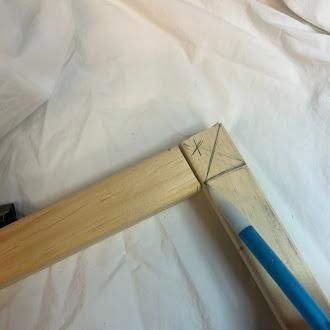

  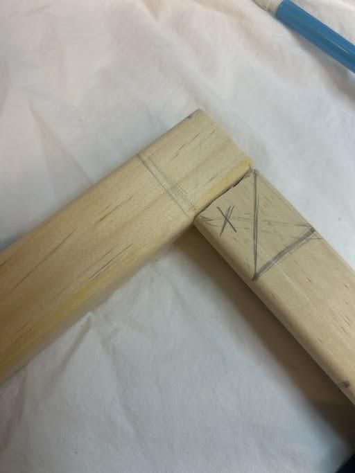

  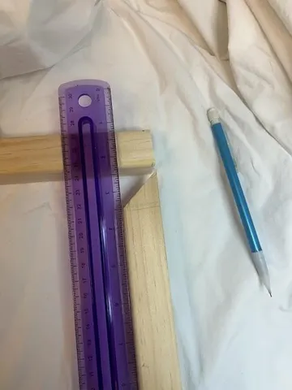

  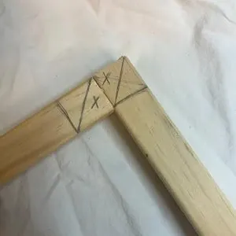

  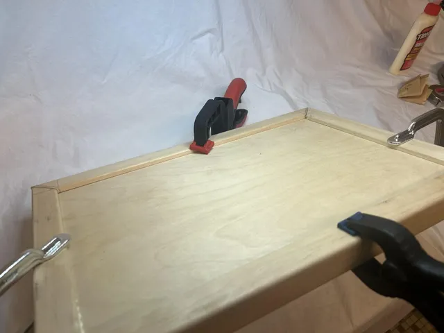

        How to cut fitted edges: https://youtube.com/shorts/_VOCZlvugyg?feature=shared
        For safe portability, it can be very helpful to add edging. 
        Grab four pieces of edging that are larger than the sides of your board. 
        To cut your edges for any-sized board, use the technique in the video and the images attached for the best fit! 
        You need to make a line on your first piece of edging based on the width of your second piece of edging. 
        It is harder to do the same thing with edging that is already cut, so use a ruler to help you, as shown in the photos.
        Then draw a diagonal line as shown in the photo based on the direction your edging needs to fit onto the board. 
        Once your four pieces are cut, clamp down the edging and use a saw to cut them down to the desired size. 
        Then use wood glue on the inside and clamp the edges to the board to dry for an hour (or multiple hours if needed).

<a href="#top">⬆ Back to Top</a>

<h2 id="step3" align="center">Step 3: Marking Holes to Drill and Adding Adjustable Feet
</h2>

  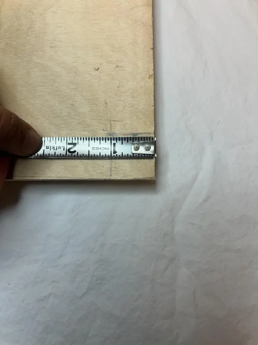

  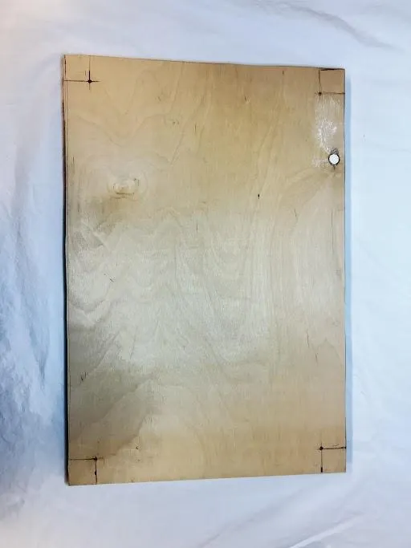

        To attach the adjustable feet to the cloud chamber, measure an inch away horizontally and vertically at each corner of the board.
        Then mark those points. The label on the adjustable feet should include the kind of drill bit needed to secure the feet into the board. 
        Make sure to drill a hole that is not too big to make sure the feet are not loose. 
        Once there are holes in the board, tap the glide socket into the board (you may need to force the glide socket into the board).
        Then, use a hammer to slide it in all the way and screw the feet into the glide socket. 
        Make sure all four feet are screwed in the same amount, so the board stands straight. Adjust the feet as needed for an even surface. 

<a href="#top">⬆ Back to Top</a>

<h2 id="step4" align="center">Step 4: Attach 3D Parts and Handles
</h2>
 

  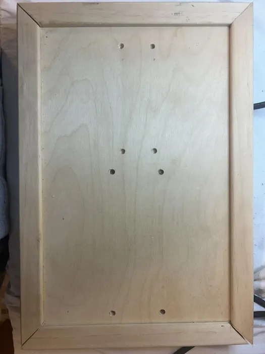

        To attach the 3D parts into the base, first place them on the wood and mark the places where the screws would be. 
        Then you can use a drill or drill press with a 1/4" drill bit and drill holes at each marked spot.
        Take the #8 x 3/4 inch wood screws and screws in the 3D printed holders for the Hyper 212 RGB fan and the 500 W power supply in the board.
        Optional: Grab the black handles and place one on each side of the board. Mark where the screws would be, drill in the holes, and then screw the handles onto the board.

<a href="#top">⬆ Back to Top</a>

<h2 id="step5" align="center">Step 5: Attaching Power Supply
</h2>

  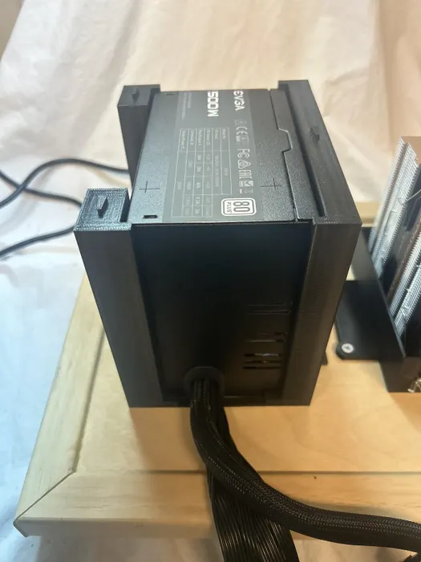

        To secure the power supply onto the board, slide the power supply into the holder with the pin connectors facing the part of the holder that has a gap. 
        Use the picture for more reference. Take the 3D printed lid and position it so that the triangles on the lid align with the extrusions on the mount. 
        Once they are aligned, you can slide the lid (direction away from you) onto the mount until it clicks. It is helpful to hold the arms of the power supply holder and use your thumb to push the lid on.

<a href="#top">⬆ Back to Top</a>

<h2 id="step6" align="center">Step 6: Preparing the Petri Dish
</h2>

  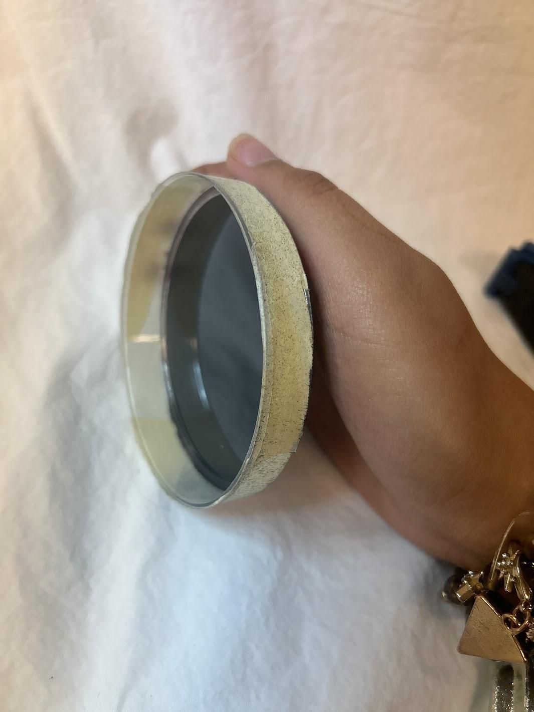

  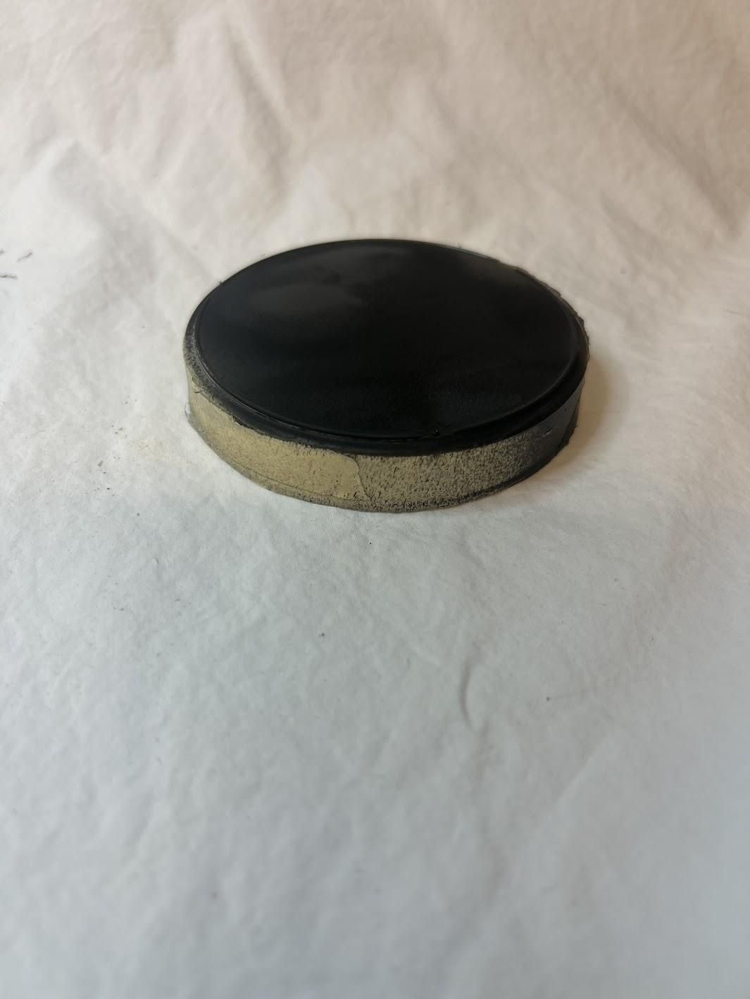

        Take the bottom of the petri dish, and cover the edges with masking tape. 
        Lay it on a piece of newspaper with the bottom facing upwards, and spray paint the back of the dish black. 
        Let it dry for at least an hour (or the recommended time on the can) and then peel the masking tape off. 
        For certain radioactive sources that extend past the width of the petri dish, it is necessary to add a hole to the side of the petri dish.
        To do this, we use a soldering iron and melt through the plastic of a petri dish. Make sure to start with a small hole and slowly increase the diameter!

<a href="#top">⬆ Back to Top</a>

<h2 id="step7" align="center">Step 7: Cutting and Gluing Chamois Cloth Onto Petri Dish
</h2>

  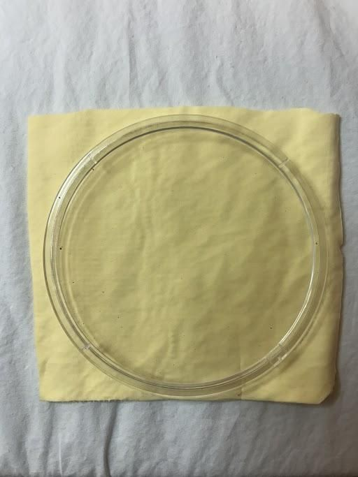

  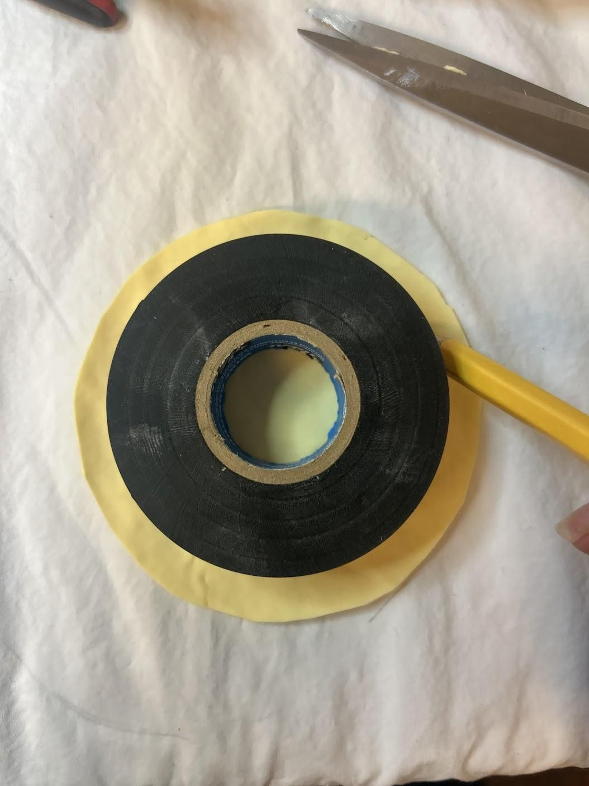

  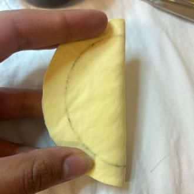

  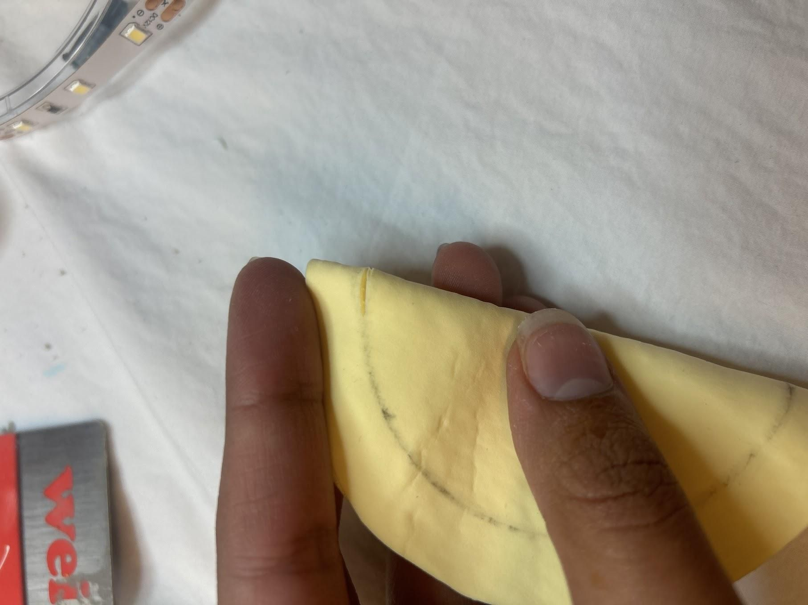

  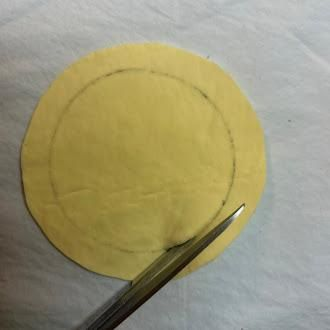

        Use the bottom of the petri dish to cut a circle of chamois cloth (it should be just under 3 and 1/2 inches in diameter). 
        Then you'll need to draw another circle inside. Use something circular to trace a smaller circle that is about 2 and a half inches in diameter (Ex. Roll of tape). 
        Then fold the circle of chamois cloth in half and cut a small opening where your inner line is. Now unfold the circle and cut along the line you drew.
        Place the ring onto the lid of the petri dish to make sure it fits correctly, and then superglue the ring onto the dish. 
        Make sure not to use too much so that the glue doesn't overflow onto the middle of the dish. 
        The leftover glue could obstruct the view of the particles later on when your cloud chamber is done!

        After the Casmear cloth is glued to the inside and well attached, flip the petri dish over and add electrical tape to the top. 
        The tape is used to cover the cloth for a cleaner design. 
        It is recommended to make a hexagon around the edges, ensuring that there is a clear viewing space in the center. 

<a href="#top">⬆ Back to Top</a>

<h2 align="center">Step 8: Mounting the D6SEC Fan
</h2>

(link ot images)

        Put the #6-32 x 3/4 through the holes you see on the bottom of the fan when the fan is facing you. 
        Very carefully place the fan into the 3D printed mount with the screws coming out of the slits in the mount, then secure the fan into the mount by screwing the wing nuts onto the screws. 
        With the power supply and the fan mounted, your cloud chamber should look like the photo above so far.

<a href="#top">⬆ Back to Top</a>

<h2 id="step9" align="center">Step 9: Converting the Power Supply
</h2>

  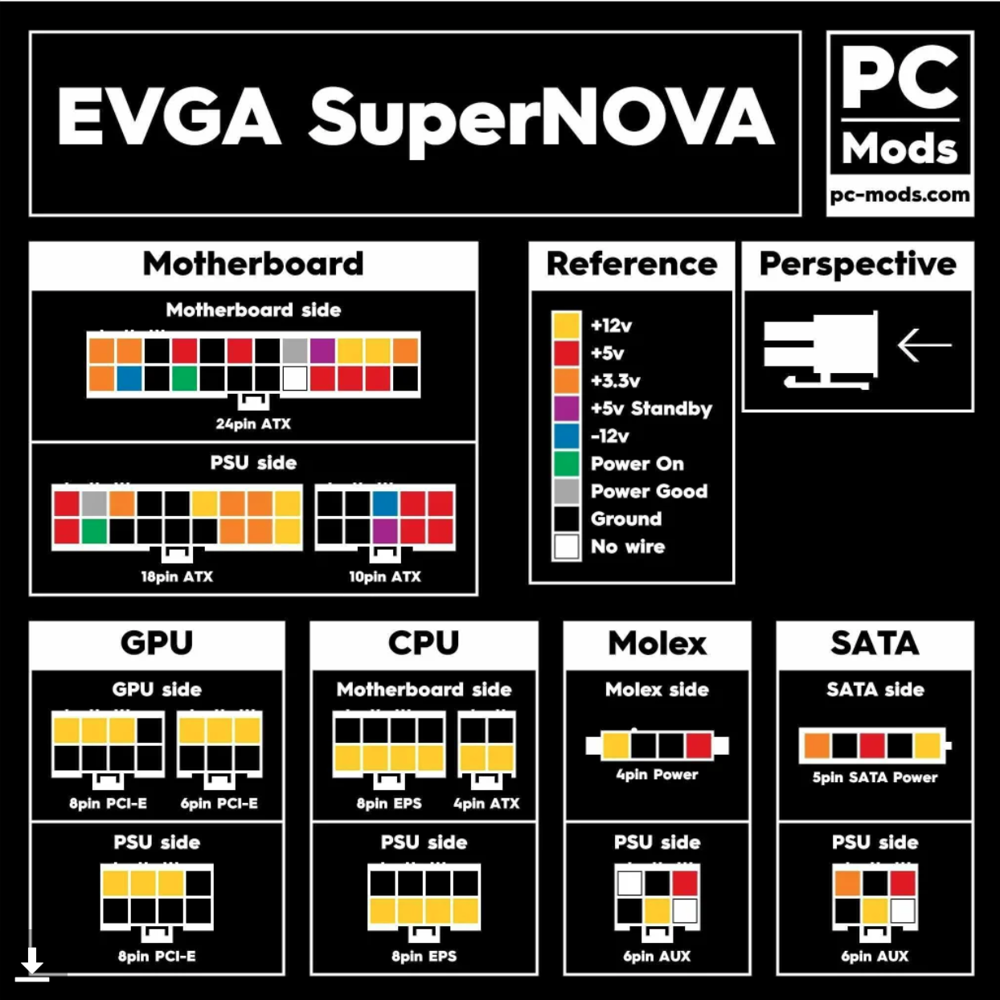

  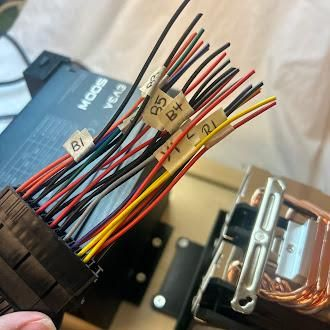

        ⚠️ Electrical Safety
            Always unplug the power supply before modifying any wiring.
            Double-check all wire connections before powering on.
            Never allow exposed wires to touch each other.
            Incorrect wiring may damage the power supply.
            If you are unsure about a connection, stop and verify it before plugging the power supply in.

        Find the 24 pin adapter on the power supply and the 24 pin connector.
        Connect the 24 pin adapter on the power supply and the 24 pin connector together.
        Take the following wires:
        6 Black wires (ground)
        2 Yellow wires (12 V)
        2 Red wires (5 V)
        1 Green Wire (Power Supply ON)
        Cut off the plastic part of the 24-pin connector that isn't attached to the power supply.
        Take masking tape and label each wire using the picture above as a reference.
        Do not cut the extra wires until the cloud chamber is completely assembled, just in case you make a mistake and need to use different wires.
        It doesn't matter which black or yellow wires you use; they carry the same voltage.
        

<a href="#top">⬆ Back to Top</a>

<h2 id="step10" align="center">Step 2:Step 10: Connecting/Soldering Wires Together
</h2>

  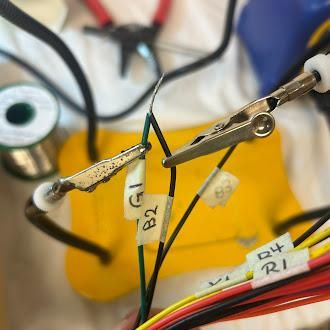

  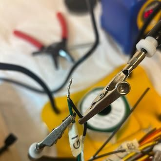

   ### ⚠️ Soldering Safety:
            Work in a well-ventilated area.
            Keep the hot soldering iron away from wires, clothing, and skin.
            Allow solder joints to cool before handling them.
            Always place the soldering iron back in its stand when not in use.
            Wear safety glasses if available.
    
        WARNING!: It's really important to do this part correctly, otherwise the power supply will not turn on, or you could brick the power supply.
        Strip the ends of Black Wire 2 and Green Wire 1. Solder the ends of Black wire 2 and Green wire 1 together. Wrap this connection with electrical tape.
        If you've never soldered wires together, not to worry! Use this link for an example.
        https://youtube.com/shorts/2N6uXyUPfgA?feature=shared
  
        Next, you will get two spare thin wires and split them. If you have never split a wire, here is a link for an example.
        https://www.youtube.com/watch?v=KpiEfuhPqew 
        
        How To Solder Wires: 
        Before soldering your wires, twist the ends of the wires together as shown in the photo. 
        Then make sure they are set up using the clips on the Helping Hands (yellow stand for soldering). 
        Make sure the sponge on the stand of the soldering iron is damp, and make sure to heat up the soldering iron to approximately 800 degrees Celsius.
        Once the power supply shows that the soldering iron is finished heating up, hold the solder up to the connection of the wires and the soldering iron, and melt the solder onto the connection. 
        Make sure the solder covers the exposed wire completely. Once you are done, wrap this connection with electrical tape.
        
        Step 10 Checkpoint:
        Before continuing:
            ☐ The power supply turns on.
            ☐ The fan spins when power is applied.
            ☐ No exposed wires are touching.
            ☐ The solder joint between Black Wire 2 and Green Wire 1 is fully covered with electrical tape.
        If all boxes are checked, continue to the next step.

<a href="#top">⬆ Back to Top</a>

<h2 id="step11" align="center">Step 11: Connect Hyper 212 RGB to Power Supply
</h2>

  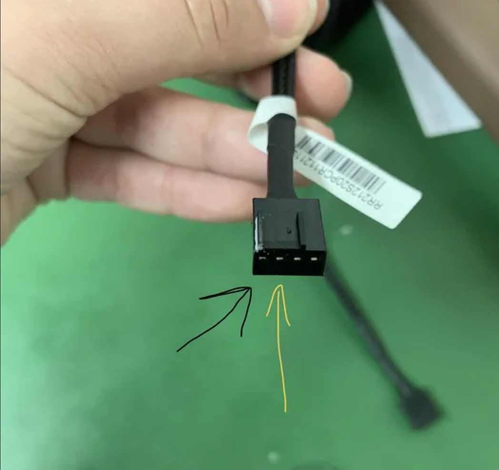

Take a photo of the wiring of the fan!!!!

        Find Black Wire 1 and Yellow Wire 1, and one spare, thinner wire, and the wires you soldered together. 
        Strip the two thin wires 1/2 of an inch on one end and 1 inch on the other.
        To use the lever nut connectors to connect the spare wires to the labeled ones, pull up the orange tab on one end, put the stripped part of the wire inside, and push the orange tab down until the wire is secure in the connector (The end with one wire from the wires you soldered previously should be connected to the yellow wire 1). 
        Do the same with the other wires on the other end. 
        Plug the extended Black Wire 1 into the far left slot on the adaptor port connected to the Hyper 212 RGB fan, then plug one of the extended Yellow Wires 1 into the slot directly next to Black Wire 1 (middle left) and leave the other extended yellow wire one out. 
      
        Step 11 Checkpoint:
        Before continuing:
            ☐ The Hyper 212 RGB fan turns on.
            ☐ Black Wire 1 is connected correctly.
            ☐ Yellow Wire 1 is connected correctly.
            ☐ Lever nuts are fully closed and secure.
        If all boxes are checked, continue to the next step.

<a href="#top">⬆ Back to Top</a>

<h2 id="step12" align="center">Step 12: Testing Peltiers
</h2>
 

  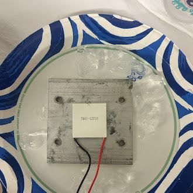

  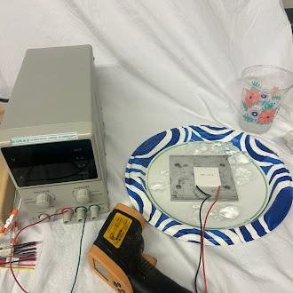

        A Peltier is a small device containing semiconductors transferring heat from one side to the other. 
        The thermal paste is made of conductive materials, improving the connection between the Peltier, fan, and petri dish, allowing heat transfer to occur more efficiently. 
        
        
        It is important to know how well the peltier can transfer heat, and if it is not working properly, it can be difficult to change and try new peltiers in an assembled cloud chamber.
        To test the peltiers, you will need a power supply, two wires, two lever nut connectors, ice, a paper plate and cup, and an aluminium block. 
        Place the ice into the paper plate with a very small amount of water. The ice water should not fill up the plate. Place the block of aluminum in the water, the top of the aluminum should be exposed.
        If it isn't, pour some water out of the plate. Use the extra wires you grabbed to connect the power supply to the positive and negative slots. 
        Use the lever nuts to connect the positive wire to the red wire of the peltier, and connect the negative wire to the black wire. Place the peltier on the aluminum block. 
        Use the infrared thermometer to take the temperature of the peltier as you alter the voltage, make sure not to exceed 12 V for the 12709 peltier, and 5 V for the 12710 peltier.
        During this process, make sure the ice is not melting enough that the water is covering the aluminum block; if so, pour some of the water out into the cup. 
        
        A working Peltier should reach negative values across the surface  as you get closer to the voltage.
        We use the aluminum block to make sure we don't burn out the Peltier while testing it. 
        
        Step 12 Checkpoint
        Before continuing:
            ☐ TEC1-12710 reaches a temperature below room temperature.
            ☐ TEC1-12709 reaches a temperature below room temperature.
            ☐ Voltage limits were not exceeded during testing.
            ☐ No damage is visible on either Peltier.
        If all boxes are checked, continue to the next step.

<a href="#top">⬆ Back to Top</a>

<h2 id="step13" align="center">Step 13: Connect Peltiers
</h2>

        ⚠️ Thermal Paste Application
            The amount and quality of thermal paste application can greatly affect cloud chamber performance.
            Apply a thin, even layer.
            Too little thermal paste will reduce heat transfer.
            Too much thermal paste can act as an insulator.
            If lightly scraped, you should be able to see the surface of the Peltier underneath.

        Take your peltiers (strip each wire half an inch if needed). Position the 12710 Peltier so that the black wire is on the left and the red is on the right. 
        The wires of the peltier should be facing you. Using the Lever nut connectors, connect the black wire to Black Wire 3, and the red wire to Yellow Wire 2.
        Now flip over the peltier so that the black wire is on the right and the red wire is on the left, with the wires facing toward you. 
        Then apply a thin, even layer of thermal paste onto the top of the 12710 peltier and use a credit card like surface to spread it. 
        Make sure there are no bumps or chunks in the paste; this is imperative to how well it works. 
        Firmly press the peltier with the thermal paste side down onto the Hyper 212 RGB fan.
        Plug in your power supply with no wires touching. If the top of the peltier is cold, you are successful! If not, try to flip the peltier over and try again.
        Take the 12709 Peltier, positioned with the black wire on the left and red on the right. Connect the red wire from the peltier and red wire 1. Connect the Black wire and Black wire 4.
        Apply a thin layer to the top of the 12710 Peltier and press the 12709 on top of it with the red wire on the right and the black wire on the left. 
        
        Step 13 Checkpoint:
          Before continuing:
              ☐ TEC1-12710 becomes cold when powered.
              ☐ TEC1-12709 becomes cold when powered.
              ☐ Thermal paste is spread evenly.
              ☐ No exposed wires are touching.
              ☐ Both Pektiers stacked together are cool to the touch
            If all boxes are checked, continue to the next step.

<a href="#top">⬆ Back to Top</a>

<h2 id="step14" align="center">Step 14: Attach 3D Printed LED Holder
</h2>

  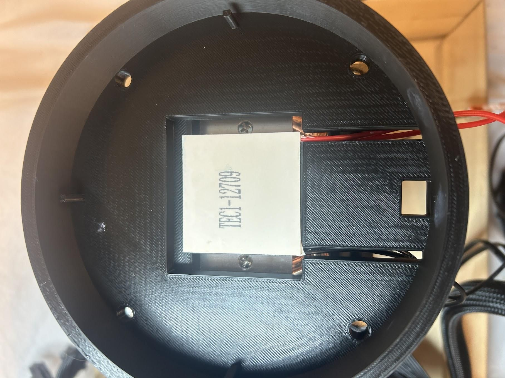

  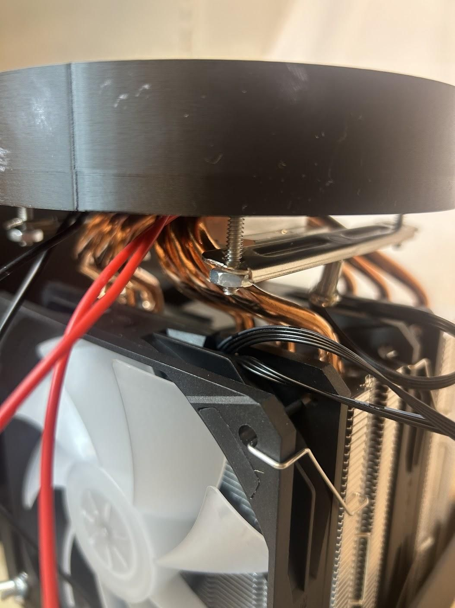

        
        Position the LED Holder so that the two slits coming out of the square are aligned with the wires of the stacked peltiers. The wires should be facing you. 
        Use the #6-32 x 1 in screws, #6 washers, and nuts to secure the LED Holder into the brackets you attached to the Hyper 212 RGB fan earlier.
        Use the pictures for reference.

<a href="#top">⬆ Back to Top</a>

<h2 id="step15" align="center">Step 15: Add Insulation
</h2>
 

  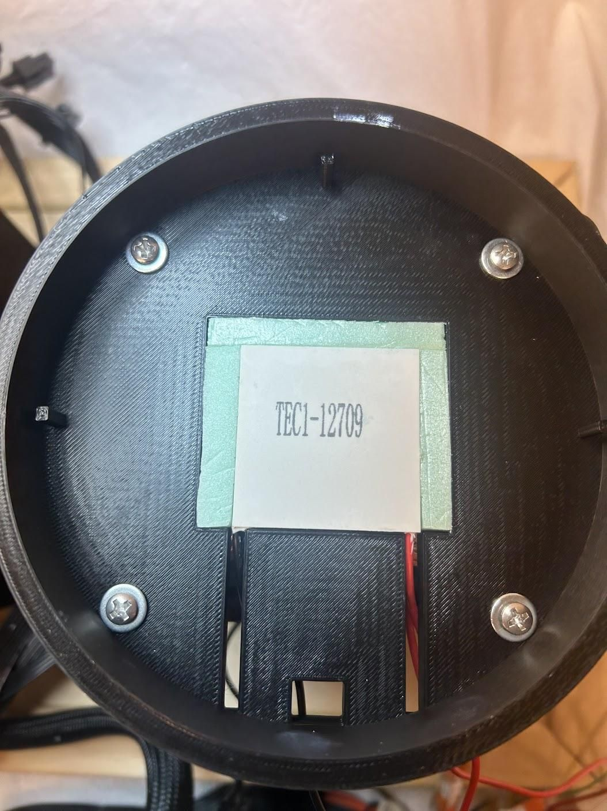

        Foam Cutting Technique: https://youtu.be/lmnCYfHl4e4?si=lr3nFRUbo9v8UpsO 
        
        Measure the gap between the peltier and the inner square wall of the LED Holder. 
        It should be a little less than 0.25 inches. Using the technique shown in the video above, cut three pieces of foam.
        Tip: Cut a piece slightly larger than what you measured, so that you can shave down the foam piece to the perfect size, little by little if needed.
        It is important that the foam pieces are not loose at all.
        Carefully push the foam between the holder and the peltiers until the holder, peltiers, and foam are level.

<a href="#top">⬆ Back to Top</a>

  
<h2 id="step16" align="center">Step 16: Connect LEDs
</h2>        

      
        Take the LED Strip lights and cut them to 16" or at a point that is relatively that size, where it is instructed for you to cut.
        Slide the end of the LED strip lights into the connector. 
        Make sure the metal arms in the connector are completely on top of the copper connections in the strip lights.
        Tightly twist and bend the ends of Black wire 5 and Yellow wire 3. Use small pliers to carefully pull up the metal pins of the LED connector. 
        Slide the black wire 5 under the negative connection's metal pin, and use the wire stripper to push down the pin onto the wire. 
        Do the same to connect Yellow wire 3 to the positive connection. 
       
        
        Alternative:
        Solder black wire 5 to the negative connection of the LED and yellow wire 3 to the positive connection of the LED strip. 
        To make this easier, use the solder to make small droplets on top of the LED strip at the connection point. 
        Then press the wires into the droplet and cover them with more solder.
        Once the wires are connected to the LEDs, wrap the connection in electrical tape.
        To make sure the connection is secure, turn on the cloud chamber and see if the lights turn on.
        Next, take Black wire 6 and Red wire 2,  and two extra, spare thin wires. Strip ½ inch off of each wire. Take one of the spare wires and attach it to Black wire 6 using a lever nut and do the same thing with the other spare wire and Red wire 2. Take the extension of red wire 2 and put the wire into the other 4 pin connector connected to the fan and put it into the slot with the arrow pointing down. To have a Green light inside the fan insert the extension of Black wire 6 in the slot directly next to the red wire. For Red lights take Black wire 6 and insert it into the middle remaining slot so that there is a slot in between the black and red wires. For Blue Lights insert Black wire 6 into the slot furthest away from Red wire 2.  Once the desired color is picked take electrical tape and wrap it around the plastic piece and the wires ensuring that no exposed wires are touching. 
        
        Step 16 Checkpoint:
        Before continuing:
            ☐ LED strip illuminates.
            ☐ Fan LEDs illuminate.
            ☐ All fans spin correctly.
            ☐ No exposed wiring is visible.
            If all boxes are checked, continue to the next step.

<a href="#top">⬆ Back to Top</a>

<h2 id="step17" align="center">Step 17: Adding the Petri Dish
</h2>

  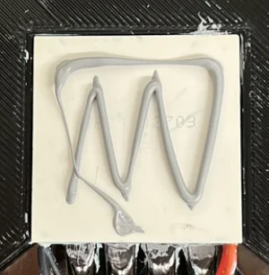

  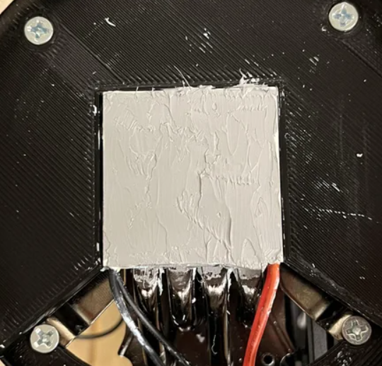

        Put a more generous amount, double the amount you put before, but still an even layer of thermal paste on top of the 12709 Peltier.
        Press the back part of the petri dish against the top of the Peltier. 
        Apply pressure to the petri dish overnight using the 3D printed puck. Place the puck inside the petri dish and put a textbook over it. 
        Leave it overnight.

        Pre-Startup Checklist
        Before adding alcohol and turning on the cloud chamber, verify the following:
            Cooling System
                ☐ Hyper 212 RGB fan spins freely
                ☐ Pelriers becomes cold when powered
            Electrical System
                ☐ Power supply turns on correctly
                ☐ All lever nuts are secure
                ☐ No exposed wires are touching
                ☐ LED strip illuminates
                ☐ Fan LEDs illuminate
            Chamber Assembly
                ☐ The petri dish is firmly attached
                ☐ Chamois cloth is securely glued
                ☐ LED cover is installed
                Ready to Start
                ☐ Chamber is on a level surface
                ☐ All tools have been removed from the workspace
                ☐ You are ready to power on the cloud chamber
            If every box is checked, proceed to Step 18.

<a href="#top">⬆ Back to Top</a>

<h2 id="step18" align="center">Step 18: Testing Your Cloud Chamber!
</h2>

  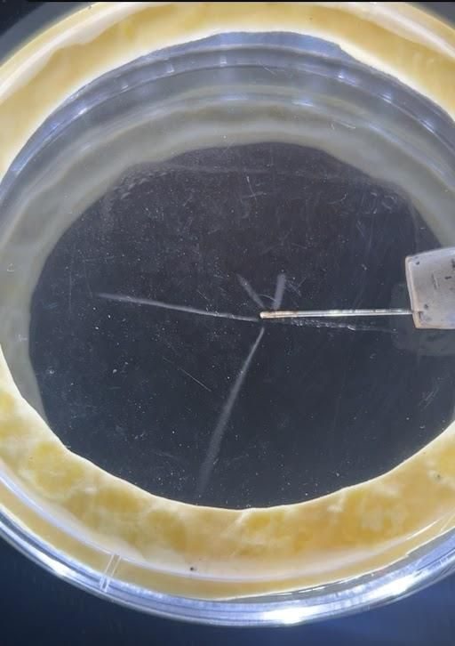

        ⚠️ Radioactive Source Safety
            Use only low-activity educational radioactive sources.
            Store radioactive sources properly when not in use.
            Avoid unnecessary handling.
            Follow all local regulations regarding radioactive materials.
            Never point or throw radioactive sources at another person.

        Once the petri dish has been pressed overnight, remove the books and the puck, and put your radioactive source inside the petri dish. 
        Take the lid of the petri dish and add 0.5mL of isopropyl alcohol and evenly spread it across the chamois cloth using a pipette. 
        Then put the lid back onto the petri dish, put the LED cover on top of the LED Holder, and turn on your cloud chamber!
        Wait a little bit, and you should start seeing mist, and then particle tracks!!!!
        Make sure that if you lift the petri dish off the Peltier, you scrape the excess thermal paste off the dish and the Peltier, and even out the thermal paste before putting the petri dish back on.

<a href="#top">⬆ Back to Top</a>

<h2 id="step19" align="center">Step 19: Throw a party!!
</h2>

                Congratulations! 
                After all the cutting, drilling, wiring, soldering, troubleshooting, and waiting, your cloud chamber is finally complete!
                Turn off the lights, grab some friends, and watch particles fly by. 
                Take some pictures, record some videos, and show off your hard work.

                Thank you for following this guide, and hopefully this project helped make particle physics a little more visible and a lot more fun.

                Physics is awesome!!! 🎉

